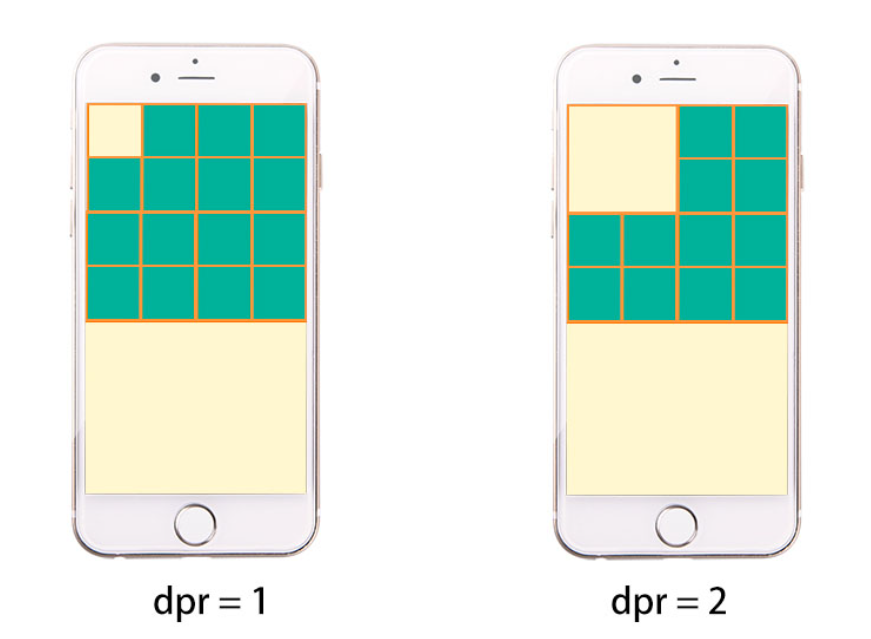
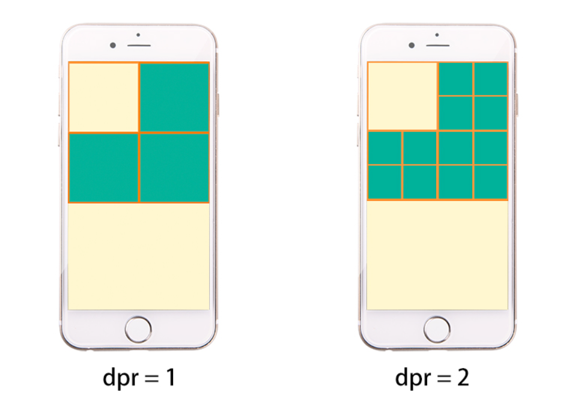

# Mobile Web / Web App Development

## 01 Terminology

1. Web Development: Building things that run in a browser, using HTML + CSS + JS as the core technologies.
   1. PC Web Development: pc browsers
   2. Mobile Web Development: mobile phone's browsers
2. Application (App) Development: Building things that get installed on a device.
   1. Native App: relies on phone's operating system (OS), install from app store / playstore
   2. Web App: app runs on browser (similar to mobile web, but behaves like app)
   3. Hybrid App: hybrid of native app and webapp

## 02 Difference between Mobile Web Development & PC Web Development

1. Screen size
2. Network & device performance
3. Interaction method
4. Compatibility

### 2.1 Screen Size

- PC has bigger screen.
- View PC Web on mobile phone is too small and thus bad experience.

## 2.2 Network & Device Performance

- Generally, pc's network and device performace will be better than mobile's.
- Mobile app needs more performance optimization.

## 2.3 Interaction Method

- PC uses mouse.
- Mobile uses finger / touch.
- We need to learn touch related events in js.

## 2.4 Compatibility

- PC browsers have a long history, so old browsers may not support new features.
- Mobile browsers started off a bit late, and are mostly webkit-based, and supports new features.
- So, mobile web has better compatibility because development don't have to consider incompatible features like PC web.

## 03 Pixels

- Tiny squares on the screen.
- If we zoom in (e.g., 240x) an image in the Photoshop, we will see the image is made up of thousands of tiny squares, each one is 1 pixel.
- image size = 200 x 300 px (200 squares wide, 300 squares tall)

> How big is 1 pixel? 
> - Pixel has no fixed size. It is different under different resolution.

## 04 Resolution

**The relationship of a screen and its resolution:**
- Resolution = How many pixels a screen is divided into.
- 1920 x 1080px = screen divided into 1920 squares wide, 1080 squares tall.

**Screen is measured in inches (diagonal)**
- Screen is designed with fixed aspect ratio: 16:9, 4:3, etc.
- The inch given is the length of screen diagonal.

- e.g., 15.6 inch screen at 16:9 ratio.
    - Use Pythagorean theorem `a² + b² = c²`
    - width = 13.6 inches
    - height = 7.65 inches
    - 1px = 13.6 inches / 1920px = 0.00708 inches x 2.54 cm = 0.018cm = 0.18mm (which is small)

**1px is different across different devices:**
- Same screen size, higher resolution, more squares, each squares are smaller, image looks clearer but smaller.
- Same screen size, lower resolution, fewer squares, each squares is bigger, image looks bigger but blurry.

**Resolution affects how an image is displayed:**

- Image size = 300 x 300 px (The image pixel count is fixed, but how big it appears depends on how large each square is on that device.)
- Resolution = 100 x 100 px, the screen can only display 1/3 of the image (not enough squares).
- Resolution = 1000 x 1000 px, the image is fully displayed, but only occupies less than 1/3 of the screen.

## 05 Device Pixel (dp), Logical Pixel (dip / CSS px) and Device Pixel Ratio (DPR)

### 5.1 Device Pixel (dp)

- Also known as hardware pixel or device pixel.
- The actual tiny dots/ squares on the screen.
- Device pixels are fixed, and do not scale based on viewport or CSS.

> We can change the display resolution in laptop settings, but it is only changing the output resolution, the physical resolution stays the same.
> - A screen of 1920 x 1080px physical pixel -> change to 1280 x 720px output resolution -> everything becomes larger and slightly blurry.

### 5.2 Device-independent Pixel (dip)

- Also known as logical pixel / CSS pixel.
- It is the unit we use in our code, e.g., CSS to make the UI the right size on the screen.
- Device-independent pixels do not have fixed physical size, Its actual size in terms of physical screen pixel can change depending on DPR.

### 5.3 Device Pixel Ratio (DPR)

- The ratio of physical pixels to logical (device-independent) pixels.
- DPR = 1: 1×1 physical pixels display 1 logical pixel (1×1 dip) → total 1 physical pixel
- DPR = 2: 2×2 physical pixels display 1 logical pixel (1×1 dip) → total 4 physical pixels
- DPR = 3: 3×3 physical pixels display 1 logical pixel (1×1 dip) → total 9 physical pixels

**Case 1: Same physical size, same resolution: 4×8 (dp), different DPR**

> Note: 
> - Resolution just means the total number of physical pixels (dp) in a screen.
> - Logical space: How many logical pixels (dip) a screen contain to put UI content
> - Logical space = Physical resolution (dp) ÷ DPR
> - Example: 4×8 dp screen with DPR=2 → logical space = 2×4 dip

- Image: 1×1 dip
- DPR=1: 1 dip → 1 dp, logical space = 4×8 dip
- DPR=2: 1 dip → 4 dp, logical space = 2×4 dip
- Conclusion: Higher DPR = smaller logical space = image appears larger.
- In reality, manufacturers always increase physical resolution proportionally with DPR to keep logical space consistent → Case 2.

**Case 2: Same size, different screen resolution, different DPR.**

- Image: 1×1 dip
- 2×4 (dp) resolution, DPR=1: 1 dip → 1 dp,  logical space = 2×4 dip
- 4×8 (dp) resolution, DPR=2: 1 dip → 4 dp,  logical space = 2×4 dip (denser)
- Image appears the same size on both screens, but DPR=2 uses 
  4 physical pixels to render 1 dip → sharper/clearer image.
- Conclusion: Use higher-resolution images on higher-DPR screens:
  - DPR=1 → 1×1 image
  - DPR=2 → 2×2 image (@2x)
  - DPR=3 → 3×3 image (@3x)

**Device DPR**
- Generally, computers' physical pixels = logical pixel (DPR=1)
- For higher-resolution computers, DPR may be different.
- Use `window.devicePixelRatio` to check DPR (JS)
- DPR is set by the manufacturer at the factory, users cannot change it. DPR is determined by hardwares.

### 5.4 Image Scaling

- Image scaling: Change how many dip (logical pixels) the image occupies.
- Example:
  - Original:    1×1 dip → on DPR=2 screen → 4 dp
  - Scale up 2x: 2×2 dip → on DPR=2 screen → 16 dp

### 5.5 Why Logical Pixels exist?

- Without logical pixels, image defined in physical pixels will display differently across screen of different resolution.
- On higher resolution screen, image appears smaller (pixels are smaller).
- On smaller resolution screen, image appears way bigger (pixels are bigger).
- As manufacturers keep increasing  screen resolution, the image would appear smaller and smaller over time.
- Logical pixels ensure the UI stays consistent across all devices!

### 5.6 Why do We Use 2x / 3x Image on Mobile Web Development?

- Image size = 32 x 32 px
- On a DPR=1 Screen, 1 logical pixel is rendered using 1 physical pixel
- On a DPR=2 Screen, 1 logical pixel is rendered using 4 physical pixel
- If we use a 32 x 32 image on a DPR 2 screen, each image pixel must be stretched to fill 4 physical pixels.
- Because the original image does not contain extra detail, those four pixels can only display the same or approximated color.
- This is why low-resolution image looks blurry on high-DPR screens.
- Therefore, we use 2x / 3x images so that the image contains enough pixel data to match the screen's physical density.

## 06 Viewport

> In browser terms, `viewport` refers to the part of the document being viewed in the browser window. Content outside the viewport is not visible until scrolled into view.

1. What is the default width of html and body element?
  - PC Sites
    - It is related to the device output resolution.
    - If a device has a 1920 x 1080 resolution, then the width of html and body (including margin) is 1920.
    - Note: It is also affected by `scale`.
    - If a device has a 1920 x 1080 resolution and the scale is 125%, then the width of html and body is `1920 / 1.25 = 1536px`
  - Mobile Sites
    - Default is 980px, without `<meta name="viewport" content="width=device-width, initial-scale=1.0">`

2. What is the result viewing a desktop site on mobile phone?
    - Without the viewport meta tag, mobile browsers set the layout viepwort as 980 CSS pixel wide.
    - Render the page as if it's a desktop site.
    - Scale the whole page down (Like zoom out / shrink) to fit the real device screen.
    - If the content width > 980px, the horizontal scrollbar will appear.

3. Why is mobile web body's width defaults to 980px?
    - Earlier websites were designed for desktop-only.
    - Typical layout around 980px
    - In order to display 980px website on mobile phones, the browser vendors introduced the layout viewport and set its width as 980px.
    - But pc web displayed on mobile browser looks small, and users used to use fingers to zoom in to view it clearly (Bad experience).
    
  
## 07 Types of Viewports

> Mobile phones have different screen sizes. It is hard to fix the browser layout viewport to a particular size.

### 7.1 Layout Viewport

- The viewport in which browsers draw a webpage (Everything in CSS, e.g.,`px`, `vw`, `vh`, `position:fixed`, `media query` is based on it).
- Fixed and do not change when zoom.
- On mobile, layout viewport = 980px without the viewport meta tag.
- `document.documentElement.clientWidth` in JS returns the layout viewport width in CSS pixels.

### 7.2 Visual Viewport

> What you see on a screen of 320px is not the full picture of the entire page of 980px.

- The portion of viewport that is currently visible.
- Change when we zoom.
- `visual viewport ≤ layout viewport`

### 7.3 Ideal Viewport

- The layout viewport when it equals the device's CSS width.
- When we use `<meta name="viewport" content="width=device-width, initial-scale=1">`.
- At initial load, no zoom, `layout viewport = visual viewport`

## 08 Meta Viewport Properties

> `width` and `initial-scale` are common, the rest are rarely used.

| Property        | Purpose                                                              |
| --------------- | -------------------------------------------------------------------- |
| `width`         | layout viewport width. `device-width` = ideal viewport               |
| `initial-scale` | decimal number, represents initial zoom level (1 = no zoom)          |
| `minimum-scale` | decimal number, represents minimum zoom allowed (useless if no zoom) |
| `maximum-scale` | decimal number, represents maximum zoom allowed (useless if no zoom) |
| `height`        | rarely used; sets layout viewport height (Almost never used)         |
| `user-scalable` | allow or forbid pinch-zoom (`yes`/`no`) - if needed                  |

## 09 Units

| Unit    | Description                                                                                                         |
| ------- | ------------------------------------------------------------------------------------------------------------------- |
| `px`    | Absolute unit.                                                                                                      |
| `%`     | Relative unit. Mainly for Flow layout                                                                               |
| `em`    | Relative to parent font size when setting font size; Relative to own font size when setting properties like `width` |
| `rem`   | Relative to root element (html) font size, mainly for mobile web layout                                             |
| `vw/vh` | Relative to viewport width and height respectively. Newer than `rem`, mainly for mobile web layout                  |
| `vmax`  | 1% of the smaller dimension of the viewport (width or height).                                                      |
| `vmin`  | 1% of the larger dimension of the viewport (width or height).                                                       |

> vmin
> - Portrait: relative to viewport width
> - Landscape: relative t viewport height

> vmax
> - Portrait: relative to viewport height
> - Landscape: relative to viewport width