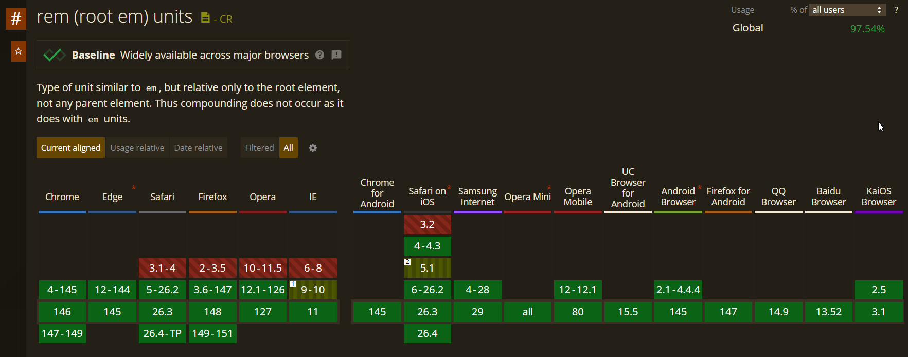
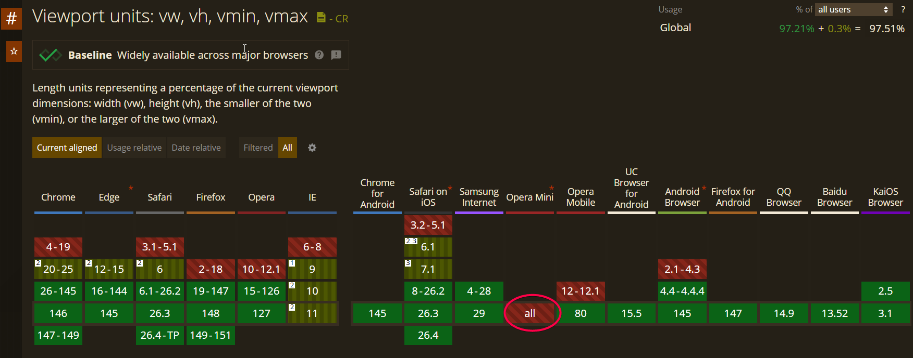

# Layout Techniques

- Flow layout, responsive layout, and rem/vw layout can be used to build mobile web.
- Flex layout and grid layout is more like a tool.
- A project can sometimes uses the mix of these techniques.

> Mobile Screen Size: 320 (min) - 480 (max) 
> - When doing media query, we can do something like 320 - 375, 375 - 480
> - Usually we won't consider 500 as the max screen width is 480px.
> - Do not use absolute unit (px) to develop mobile site.

## 01 Flow Layout (%)

- Use % and `box-sizing: border-box;`
- Downside: Extra media queries to adjust font-size and gaps.
- Some techniques:
  - 1. Proportional scaling of squared element - keeping width and height equal as the screen size changes.
  - 2. Image scaling - handling aspect ratio mismatch between the container and image inside.
  - 3. Horizontal gap - uses padding.
  - 4. Vertical gap - uses padding / margin.


**Iphone Safe Area:**

- Standard tabbar height: 100px

1. Add `<meta name="viewport" content="width=device-width,viewport-fit=cover,initial-scale=1.0"/>` to fill the safe area / home indicator area.
2. To prevent tabbar content covered by the navigation bar (Iphone black line at the bottom), add the following CSS:

**Method 1:**
- Make sure the element is not a border-box, otherwise, the element content reduces.

```css
/* IOS<11.2 */
padding-bottom: constant(safe-area-inset-bottom);
/* IOS>11.2 */
padding-bottom: env(safe-area-inset-bottom);
```
**Method 2:**

```css
/* IOS>11.2 */
height: calc(50px+ constant(safe-area-inset-bottom));
/* IOS>11.2 */
height: calc(50px + env(safe-area-inset-bottom));
```

## 02 Rem Layout

> Recommend testing using real device.

- Mobile web only.

**Work Flow:**
1. Ask the designer to create the mobile design mockup at 750px width.
2. Develop normally using px based on 750px-wide design mockup.
3. Decide how many parts to divide the page into. Standard: `10 parts`
4. Calculate the size of 1 rem `clientWidth / parts`
5. Set the html font-size
6. Update the tool setting with the size of 1rem (Must be integer) and convert px to rem using tool.

```js
/* Dynamic font-size calculation across all mobile device width */
function initPage() {
  // Obtain the device client width
  const clientWidth = document.documentElement.clientWidth;
  // How many parts to divide the page into
  const parts = 10; // 10 parts (e.g)
  // Calculate the font-size for this screen size
  const fontSize = clientWidth / parts;
  // Set the html font-size
  document.documentElement.style.fontSize = `${fontSize}px`;
}

initPage();

// Recalibrate on screen resize
window.addEventListener("resize", initPage);
```


> Some defensive CSS techniques to prevent text overflow:

**Single-line Ellipsis**

```css
/* Keep text in a single line */
white-space: nowrap;

/* Hide overflowed text */
overflow: hidden;

/* Show … for overflowing text */
text-overflow: ellipsis;   
```

**Multi-line Ellipsis**

```css
/* Hide the overflowing part */
overflow: hidden;

/* Show ellipsis (...) when text overflows */
text-overflow: ellipsis;

/* Display the element as a flexible box (old WebKit flexbox model) */
display: -webkit-box;

/* Limit the content inside the block container to a specified number of lines */
-webkit-line-clamp: 2;

/* Arrange the children of the flexbox vertically */
-webkit-box-orient: vertical;
```
## 03 Vw Layout

- 100vw = viewport width
- The entire screen width is divided into 100 parts. 1vw = 1% of viewport width.
- Rely on screen size.
  - 350px screen -> 1vw = 3.5px
  - 750px screen -> 1vw = 7.5px
  - The calculation is done by the browser.
  - Unlike the rem layout approach, no manual JavaScript required.

```
If design mockup = 750px
1vw = 7.5px
?vw = 300px?

?vw = (300px / 7.5px) * 1vw
Formula: ?vw = elementPx / 7.5
```

**WorkFlow is similar to Rem Layout**
> - Only exclude the javascript part.


## 04 Compatibility

> If vw is so easy, why do we still need rem?

- Until now, `vw` and other viewport units still have compatibility issue.
- Unless we are not considering IE and the opera mini browsers, we can choose vw.

**rem:**


**vw:**



**Note:**

- Business side: We may use latest technology and worry less compatibility issues - we will usually ask the client to access the webapp with a particular browser.
- Consumer side: We need consider compatibility.

## 05 `1px` Problem

**Design Draft**
- Mobile website is designed at 750px mockup.
- During development, the layout is usually implemented at 375px viewport width (half of the design draft).
- So, 1px  (design) = 0.5 CSS pixel
- However, fractional pixel is handled differently in different browsers on different devices.
  - Old IOS & Android phones, <0.5px treats as 0px, >= 0.5px treats as 1px.
  - IOS treats >=0.75px as 1px, <0.75px as 0.5px, and <0.5px as 0px.
  - Note: 1px height vs 1px border may render differently.
  - Conclusion: Avoid using pixel values smaller than 1px directly.


**The Exact Size of 1px on Display:**
- 1px is rendered differently depending on DPR.
  - dpr=1, 1 CSS pixel uses 1 device pixel
  - dpr=2, 1 CSS pixel uses 4 device pixels (2x2)
  - dpr=3, 1 CSS pixel uses 9 device pixels (3x3)
  - Relationship: device pixels = CSS pixels * DPR^2
- In design tools, 1px represents the thinnest possible line, equals to 1 device pixel, not 1 CSS pixel.
- On high DPR screen, a CSS 1px border / line may appear thicker, so we need scale down to match the designer's 1 device pixel line.
  - DPR=2, we scale the line down 1/2. 
  - DPR=3, we scale the line down 1/3.
  - Using transform.


**Solution: Pseudo-element + transform + media query**

```css
.border-1px::after {
  position: absolute;
  display: block;
  content: "";
  width: 100%;
  height: 1px;
  background-color: red;
  left: 0;
  bottom: 0;
  /* Optional */
  transform-origin: 50% 0%;
}

/* dpr=2, scale down 1/2 */
@media only screen and (-webkit-min-device-pixel-ratio: 2) {
  .border-1px::after {
    transform: scaleY(0.5);
  }
}

/* dpr=3, scale down 1/3 */
@media only screen and (-webkit-min-device-pixel-ratio: 3) {
  .border-1px::after {
    transform: scaleY(0.33);
  }
}
```

**Optional: Using Js to check and add corresponding class name**
```js
// Example
if (window.devicePixelRatio && window.devicePixelRatio >= 2) {
  document.querySelector(".box").classList.add("border-1px")
}
```